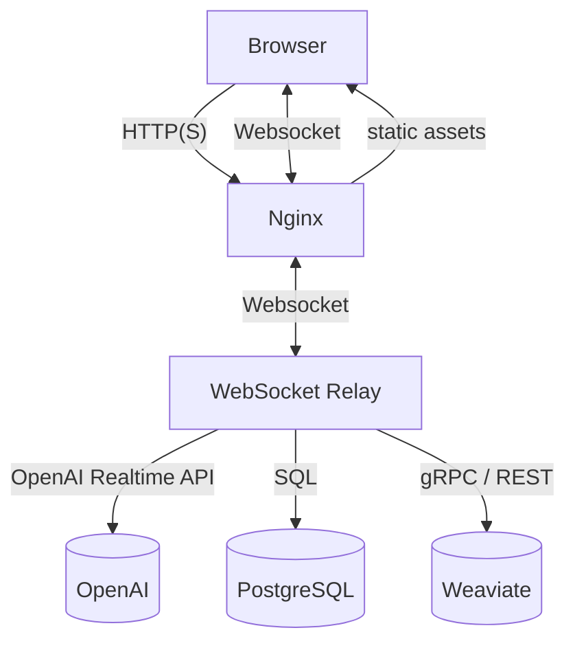

# Project Architecture & Component Breakdown

> **Table of contents**
>
> 1. [Overview](#overview)
> 2. [High-level Data Flow](#high-level-data-flow)
> 3. [Services (Docker Compose)](#services-docker-compose)
> 4. [Frontend](#frontend)
> 5. [WebSocket Server](#websocket-server)
> 6. [Databases](#databases) – PostgreSQL & Weaviate
> 7. [NGINX Gateway](#nginx-gateway)
> 8. [DigitalOcean Spaces Storage](#digitalocean-spaces-storage)
> 9. [Local Development Tips](#local-development-tips)
> 10. [Diagrams](#diagrams)

---

## Overview

This repository contains a **realtime oral-assessment platform** consisting of a React/Vite SPA, a Node.js WebSocket backend that connects to the OpenAI Realtime API, and supporting services (PostgreSQL, Weaviate, NGINX). Everything is orchestrated with Docker Compose for a plug-and-play local or production deployment.

---

## High-level Data Flow

1. **User** opens `http://localhost:8000` and the SPA is served by NGINX.
2. Browser initiates a WebSocket connection to `/relay/<assessment-type>` (e.g. `/relay/fruition`).
3. **WebSocket Relay** (`websocket-server`) spins up an `@openai/realtime-api-beta` client, injects assessment-specific tools/prompts, and streams audio & text between OpenAI and the browser.
4. Relay stores conversation transcripts in **PostgreSQL** and vector representations in **Weaviate**; large uploaded audio files are optionally persisted to **DigitalOcean Spaces**.
5. NGINX routes `/relay/*` WebSocket traffic to port `8080`, and serves the built frontend from `/dist`.

---

## Services (Docker Compose)

| Service (container)  | Directory           | Purpose                                                | Key Ports                              |
| -------------------- | ------------------- | ------------------------------------------------------ | -------------------------------------- |
| **frontend**         | `/frontend`         | React SPAA – UI, audio capture, waveform visualisation | 3000 (container) via NGINX 8000 (host) |
| **websocket-server** | `/websocket-server` | Node.js relay between browser & OpenAI                 | 8080                                   |
| **nginx**            | `/nginx`            | Reverse proxy, static file server, SSL terminator      | 80 (container) -> 8000 (host)          |
| **postgres**         | _(image)_           | Stores transcripts & assessments                       | 5432                                   |
| **weaviate**         | _(image)_           | Vector search / semantic similarity                    | 8087 REST, 50051 gRPC                  |

All services share the user-defined Docker network `voice-chat-pa-app-network`.

---

## Frontend

Location: `frontend/`

Main entry points:

| File                               | Responsibility                                                                                                  |
| ---------------------------------- | --------------------------------------------------------------------------------------------------------------- |
| `src/main.tsx`                     | Bootstraps React app and mounts to DOM.                                                                         |
| `src/App.tsx`                      | Top-level routes/layout.                                                                                        |
| `src/pages/ConsolePage.tsx`        | **≈1 kLOC** — core page handling microphone capture, VAD, WebSocket integration, UI state.                      |
| `src/pages/LoginPage.tsx`          | (Optional) Entra ID login workflow.                                                                             |
| `src/components/*`                 | Re-usable UI (Alert, Buttons, Toggles, Spinners) and assessment-specific content (e.g. `DTLAssessmentContent`). |
| `src/utils/wav_renderer.ts`        | Draws live audio waveform on `<canvas>`.                                                                        |
| `src/utils/conversation_config.js` | Maps assessment types to config (initial system messages, rubric, etc.).                                        |

Key runtime flow:

1. **Audio capture** via Web Audio `MediaStream` → encoded PCM chunks.
2. Chunks are transmitted over WebSocket as base64 and also locally rendered to waveform.
3. UI listens for messages (`response.text.delta`, `response.audio.delta`, etc.) and updates conversation log, audio player & transcript.
4. Push-to-talk/VAD mode toggles are handled via page-level `useState`.
5. Errors surface through the global `AlertContainer`.

Hot-reloading is enabled with `vite dev` **or** via bind-mounts when using Compose (edits reflect instantly).

---

## WebSocket Server

Location: `websocket-server/`

### Entry Point `server.js`

1. Validates presence of `OPENAI_API_KEY`; initialises Sentry when `SENTRY_DSN` set.
2. Connects to Weaviate (`lib/weaviate-schema.js`) and initialises schema + material import scripts (`scripts/import-*.js`).
3. Configures assessment "agents" (DTL, Fruition, Checklist) with their tool-functions and question banks.
4. Creates a `RealtimeRelay` instance (see below) on port `8080`.

### Core Class `lib/relay.js`

- Wraps `@openai/realtime-api-beta`.
- One `RealtimeClient` per websocket connection.
- Intercepts/filters events, logs optional traffic, captures assistant & user audio, performs post-conversation assessment with `getAssessTranscript`.
- Saves transcripts using `lib/db.js` (PostgreSQL wrapper) and merges/down-loads audio using `lib/download-audio.js` when `saveAudio` enabled.

### Supporting Modules

| Path                     | What it does                                                              |
| ------------------------ | ------------------------------------------------------------------------- |
| `chatbots/*.js`          | Assessment-specific prompt engineering, tool definitions & question sets. |
| `db/`                    | `init.js` sets up connection; `migrations/*.sql` define schema.           |
| `lib/weaviate-schema.js` | Programmatic creation of Weaviate classes & properties.                   |
| `scripts/import-*.js`    | One-off ingestion of course materials (Markdown / JSON) into Weaviate.    |

---

## Databases

### PostgreSQL

- Containerised using `postgres:15-alpine`; data persisted in `postgres_data` volume.
- Tables (see `db/migrations/`):
  - `assessment` – metadata for each user session.
  - `transcript` – every utterance with timestamps, device info, optional location.

### Weaviate

- Acts as a **vector database** for semantic search / retrieval-augmented generation.
- Schema defined at runtime by `weaviate-schema.js` – classes include `Material`, `AssessmentContext`, etc.
- Accessible on `http://localhost:8087` (REST) and `grpc://localhost:50051`.

---

## NGINX Gateway

Location: `nginx/nginx.conf`

Key responsibilities:

1. Serve `/dist` (built frontend) ➜ `index.html` fallback for SPA routing.
2. Proxy `/relay/*` (websockets) → `websocket-server:8080`.
3. Forward other API routes if needed (`/api/*`) to future backend services.
4. Configure gzip & caching headers.

During **development** the compose setup still uses NGINX so the URL and CORS behaviour remain identical to production.

---

## DigitalOcean Spaces Storage

Relay supports off-loading merged audio recordings to an S3-compatible bucket (DigitalOcean Spaces). Environment variables:

- `DO_SPACES_ENDPOINT`, `DO_SPACES_REGION`
- `DO_SPACES_ACCESS_KEY`, `DO_SPACES_SECRET_KEY`
- `DO_SPACES_BUCKET`

If these are not provided, audio is stored only locally inside the container.

---

## Local Development Tips

- **Frontend only**: `cd frontend && npm run dev` (Vite @ `localhost:3000`). Use env `VITE_LOCAL_RELAY_SERVER_URL` to point to a running relay.
- **Backend only**: `cd websocket-server && npm start` (or `npm run dev` with nodemon) – remember to also run Postgres & Weaviate.
- **Full stack**: `docker compose up --build` – the recommended path; hot-reloading for frontend works via volumes, while backend requires restart for deep code changes.

---
